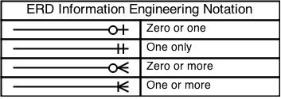
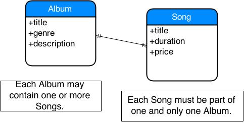
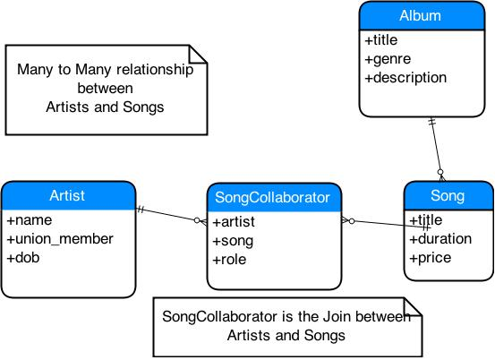

# Has Many Through (Albums, Songs, Artists)

## Objectives

By the end of this, students should be able to:

- Learn about the, often forgotton, art and science of Data Modelling.
- Learn about many to many relationships.
- Learn about how Join tables and their associated models can 
	represent relationships between entities.  
- Use Rails has_many through to construct relationship.

## Data Modeling

Data Modeling is a wonderful and well researched area of expertise. Many have spent entire careers modelling common problems that come up over and over when creating software. 

*Please remember that most problems have been solved, many, many times. And it's important to search out and understand the work of others before going off and re-inventing your own, rather oblong-ish, wheel.* 

IMO, the treasure trove of information about Data Modelling is very much under utililized. And it's area, *somewhat like functional programming*, that software developers can rediscover from the past.  


What are the cardinalities of relationships?  

* 1 - 1 relationships.  
	Usually indicates that it should be an attribute. *In rails this is a has_one and belongs_to*.    
* 1 to Many and Many to 1.  
	Make up the bulk of the relationships. *In rails this is a has_many and belongs_to*.   
* Many to Many.  
	Are almost always broken into **join** entities. *In rails this is a has_and_belongs_to_many(habtm) or has_many :through. Almost always the latter.*

>> Each \<entity\> **Must** be OR **May** be \<relationship name\> **one and only one**  OR **one or more** \<second entity\>

For example:

Each Song **must** be part of **one and only one** Album.  

* entity is Song.  
* relationship name is "part of".  
* cardinality is **one and only one**
* second entity is Album.  

Each Album **may** contain **zero or more** Songs.

* entity is Album
* relationship is "contain"
* cardinality is **zero or more**
* second entity is Song.

We can create an Entity Relationship Diagram(ERD) using [Crows Foot Notation](http://www.tdan.com/view-articles/7474)
	


For example, this the Data Model for this application.  




### References
* [How to read a Data Model](http://www.essentialstrategies.com/publications/modeling/howtoread.htm)  
* Entity Relationship Diagrams.  
	[Crows Foot Notation](http://www.tdan.com/view-articles/7474)
* This is a wonderful book to look for well thought out solutions to common problems in multiple domains.  
	[Data Model Resource Book Vol 1](http://www.amazon.com/Data-Model-Resource-Book-Vol/dp/0471380237/ref=pd_sim_b_6?ie=UTF8&refRID=115VGWZVRRY5WWCKKZRT)

* A Data Modeling Classic.  
[Data Modelling Patterns](http://www.amazon.com/Data-Model-Patterns-David-Hay/dp/0932633749)

* A 2003 book that describes how to think about designing and modelling software applications. A classic, that the Rails world discovered about 2008-9. *After Rails apps got big enough to demand design rigour*.  
	[Domain Driven Design](http://www.amazon.com/Domain-Driven-Design-Tackling-Complexity-Software/dp/0321125215)

### Always, always draw a Data/Domain Model.

**Did I say always enough?**

## What we've given.

We are going to start off with a working, but limited app. What we have is a app with two models, **Song and Album**.


## Demo: Create an Artist

```
rails g scaffold Artist name union_member:boolean dob:date
```

Now we have an Artist that can have a name and may be a union_member and has a Date of Birth.

By default the Artist will be a union member. *Add this to the Artist migraiton*  

```
     t.boolean :union_member, default: true
```

Migrate to add the artists table to the database.  
```
rake db:migrate
```

## Lab

Create an artist in the rails console. And create, update and delete the Artist in the UI.

## Demo: Make a Songs Contribution Join Table.

Lets create a **Many to Many** relationship between Artists and Songs. 

Each artist could have contributed to many songs. And each song could have many artists that contributed to the song.

#### Create SongContribution model.

Create a **JOIN** model that will represent the **Many to Many** relationship between Songs and Artists.  

```
rails g migration CreateSongContribution song:belongs_to artist:belongs_to role:string
```
Run the migrations. *May have to drop/create/migrate the DB*

```
rake db:migrate
```

**This is the Data Model for this many to many relationship.**




## Lab 
Draw the Physical Database Tables for this Data Model. *Keep it around, we're going to fill in rows later*

## Demo

Create a Join model for song contributions in app/models/song_contribution.rb  *Notice the namimg convention here*


```
class SongContribution < ActiveRecord::Base

  belongs_to :artist
  belongs_to :song

end

```

Add song contributions to the artist model.  ** We will use a through relationship to find the artist's songs!**

```
class Artist < ActiveRecord::Base

  has_many :song_contributions
  has_many :songs, through: :song_contributions
end

```


Add song contributions to the song model.  ** We will use a through relationship to find the song's artists!**

```
class Song < ActiveRecord::Base
  belongs_to :album

  has_many :song_contributions
  has_many :artists, through: :song_contributions
end
```

Add seed data.  

```
Song.delete_all
Album.delete_all

nevermind = Album.create!(title: "Nevermind", genre: 'rock')
sea_change = Album.create!(title: "Sea Change", genre: 'jazz')

golden_age = sea_change.songs.create!(title: 'golden age', price: 1.99, duration: 215)
lost_cause = sea_change.songs.create!(title: 'lost Cause', price: 4.99, duration: 182)
lonesome_tears = sea_change.songs.create!(title: 'lonesome Tears', price: 2.99, duration: 156)

lithium = nevermind.songs.create!(title: 'lithium', duration: 193, price: 1.99)
come_as = nevermind.songs.create!(title: 'come as you are', duration: 177, price: 1.49)

Artist.delete_all
SongContribution.delete_all

kurt = Artist.create!(name: 'Kurt Cobain', dob: DateTime.parse("February 20, 1967") )
dave = Artist.create!(name: 'Dave Grohl', dob: DateTime.parse("January 14, 1969"))
beck = Artist.create!(name: 'Beck Hansen', dob: DateTime.parse("July 8, 1970"))

```

In the console:

* Get an artist.  
	> kurt = Artist.first

* Show all the songs he has contributed to.
	> kurt.song_contributions

* Show all his songs. This is using a through relationship.  
	> kurt.songs

* Get a Song.  
	> come_as = Song.last


* Create a SongContribution.  
	> kurt.song_contributions.create(role: 'writer', song: come_as)

* Reload the artist from the DB.  
	> kurt.reload

* Kurt now has one song.  
	> kurt.songs

* See how a JOIN was created.  
	> SongContribution.all

* Another way to create contribution.
	> lithium	= Song.find_by(title: 'lithium')  
	
	> SongContribution.create!(artist: kurt, song: lithium, role: 'guitar')  
	
	> kurt.reload
	  
	> kurt.songs

	> SongContribution.all  

## Lab
#### In the Rails console.
- Make Beck the 'writer' of 'Lost Cause'. Use beck.song_contributions.create.  

- Make Beck the 'singer' for 'Lonesome Tears'. Use SongContributor.create. 

- Make Beck the 'writer' of 'Golden Age'. Use beck.song_contributors.build. Then beck.save.  

- Make Dave Grohl the guitarist on both Nirvana songs. Use \<song\>.artists.create here.

#### Draw the contents of the DB.
- Draw the contents of each Artist, SongColloborator and Song table in the DB at this point.
- Show an instructor your drawings.

#### Populate/Seed the DB with the above.
Use \<artist\>.song_contributions.create here.  

#### In the UI
- Take a look at each Artist's songs.
- Take a look at each Song's artists.

Oops, some work needs to be done here, ay! Lets do that below.


## Demo

Lets learn how we can manage [Nested attributes](http://api.rubyonrails.org/classes/ActiveRecord/NestedAttributes/ClassMethods.html).


Add **accepts_nested_attributes_for** so that an artists songs and song contributions can be created or updated when updating an artist.  

```
class Artist < ActiveRecord::Base

  has_many :song_contributions
  has_many :songs, through: :song_contributions

  accepts_nested_attributes_for :song_contributions, :songs
end
```

In the Rails Console:  

- Notice that adding *accepts_nested_attributes_for* creates new setter methods (songs_contributions_attributes= and songs_attributes=)  
	> kurt = Artist.first  
	> kurt.methods.grep /attributes/  

- Create a hash, yep like a params hash in the controller. This hash should have a key of for one of these new setter methods and a values that is array of hashes. *The array will have hashes used to create child relationships*  
	> params = {songs_attributes: 	[{title: "Teen Spirit", duration: 123, price: 1.49}] }

- Update an artist to have this new song.  
	> kurt.update(params)
	
- Show that kurt has a new song and a new song contribution was created.  
	> kurt.reload  
	> kurt.songs.count  
	> kurt.songs.last  
	> kurt.song_contributions.last  
	
- Make kurt a writer of this song.  
	> kurt.song_contributions.last.role = 'writer'  
	> kurt.save  
	> kurt.reload  
	> kurt.song_contributions.last  
	
- Oh, the duration of the song is wrong. It should be 199 minutes.  
Notice how when **updating** the song we need to pass it the **id** of the song to be updated.  
*Note: your id will probably be different*  
	> params = {songs_attributes: [{id: 22, duration: 199}] }  
	> kurt.update(params)  
	> kurt.reload  
	> kurt.songs.last  
	
	
## Lab

In the Rails console, make Dave Krohl the writer of the song "In Bloom". Use a params hash and the Artist#update method for this.

*Hopefully, no rapid Nirvana fans will hunt me down for messing up who contributed what, ay.*    

## Demo. Add Songs to Artists from UI

Lets create a UI that will allow us to manage an Artist's songs.

* In the Artist show action add this to show all the artist's songs.  

```
 <h2><%= pluralize(@artist.songs.count, 'song') %></h2>
 <ul>
  <% @artist.songs.each do |song| %>
  <li>Title: <%=song.title %>, Duration: <%= song.duration%>, Price: <%= song.price %></li>
  <% end %>
 </ul>
```

* In the Artist edit action add **fields_for**. This will generate the HTML form fields needed to update the artist's songs.  

```
 <%= f.fields_for :songs do |s| %>
  <hr>
  <div class="field">
    <%= s.label :title %><br>
    <%= s.text_field :title %>
  </div>
  <div class="field">
    <%= s.label :duration %><br>
    <%= s.number_field :duration %>
  </div>
  <div class="field">
    <%= s.label :price %><br>
    <%= s.text_field :price, value: s.object.price.round(2) %>
  </div>
  <% end %>
```

* Change the artist_params method so that we will allow users to change an artists songs. This will permit the songs_attributes in the params hash.   

```
def artist_params
  params.require(:artist).permit(:name, :union_member, :dob, songs_attributes: [:id, :title, :duration, :price ])
end
```

* Edit the artist Kurt Cobain.